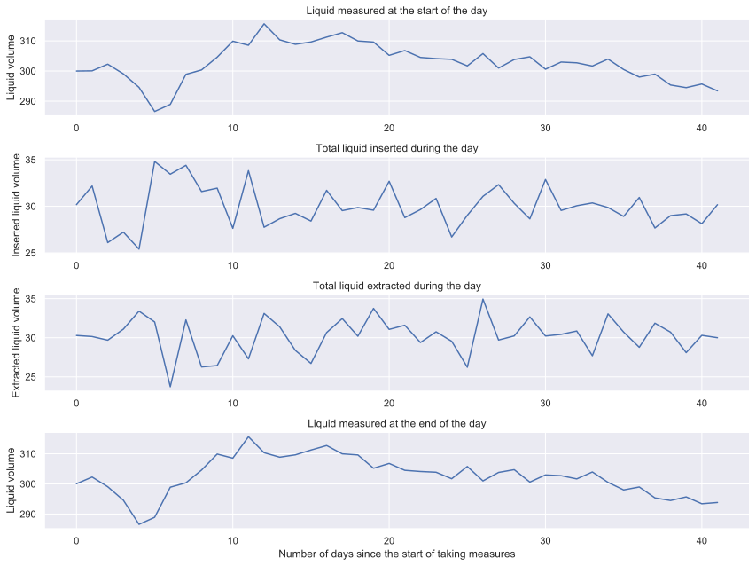
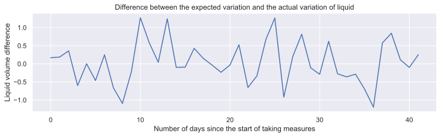
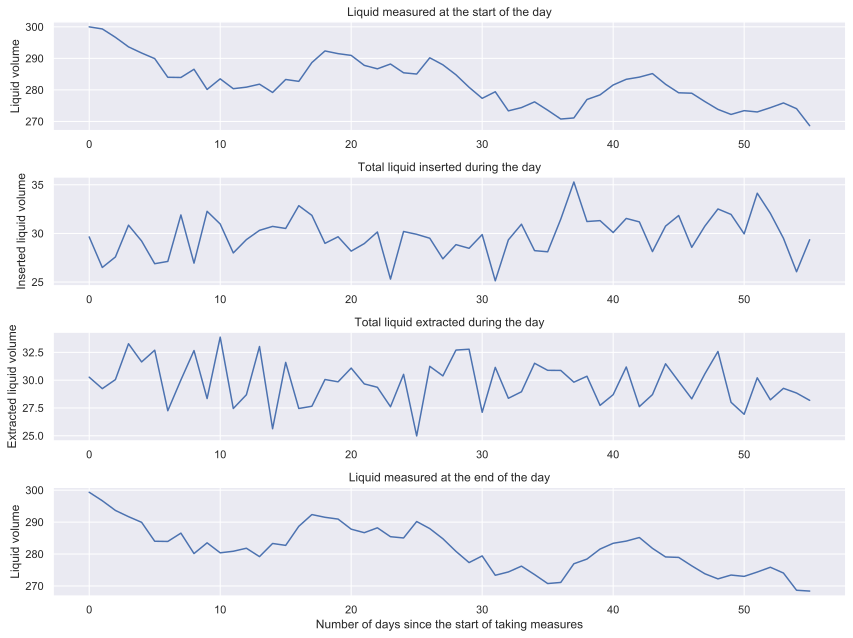
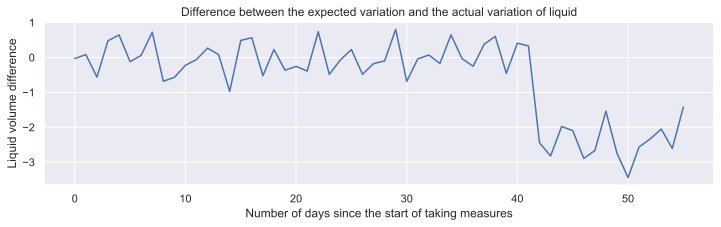

# Leak Detection

In this project we'll build a simulation to represent the work done in a liquid tank. And then use samples generated from this simulation to build a leak detector.

Each day the volume of liquid in the tank is measured at the start of the day, during the day there are many extractions and insertions and at the end of the day, the volume of the liquid is measured again. The problem is that there could be a leak and we have to build a model to detect them.

## Assumptions
- There is enough liquid in the tank initially to not worry about extracting more liquid than the actual liquid in the tank.
- The tank has enough capacity to not worry about inserting more liquid than the capacity of the tank.
- Usually there is as much liquid inserted as extracted. Thus, the insertions and extractions are modelled as normal distributed random variables centered in the same mean. The standard deviation represents variations due to not inserting and extracting exactly the same liquid every day and due to measurement errors.
- Daily measurements of the liquid in the tank have some gaussian noise to represent measurement errors.
- A leak is a constant volume of liquid disappearing each day.

## Data and baseline model introduction
With these assumptions we can generate samples of how the liquid measured varies over time. For each day we'll have the liquid measured at the start of the day, the total volume inserted during the day, the total volume extracted during the day and the liquid measured at the end of the day.

Every sample will start with 28 days with no leak. After that, some extra days with no leak will follow. These days are taken from a geometric distribution so not every sample has the same length. After that, 14 days could follow with a constant leak of 0.1 liters/hour (2.4 liters/day) with probability 0.1.

Below we can see a sample without leak. Though, the liquid measured at the start and at the end of the day show a downward trend during most of the series. So, if we didn't know that there is no leak, how can we know?

We have the measures at the start and end of the day, so we can calculate the difference between both. And that should give us approximately the same value as the total variation for that day (extractions and insertions). So the difference between them should be some random noise left due to sensor errors.

Now, with a sample with leak. Again we can't really tell at first glance if there is a leak looking at the liquid measured at the end of the day.

But the difference between the expected variations and the variations has a significant shift. This drop looks so clear due to modelling the leak as a constant that is substracted each day. Though it is a small leak, if it were to grow, the difference would get greater and clearer to us each day.

## Baseline model
So, a simple baseline model would be the following: calculate the mean and standard deviation of these difference on the training data (first 28 days). If some day ends with a significant difference (5 standard deviations below the mean), then we say that there is a leak.

Now, we apply this model to 1000 samples, some with leaks and some with no leak (recall that the probability of a sample having a leak is 0.1).
    
    TP =   88
    FP =    1
    
    TN =  909
    FN =    2
    
    Confusion Matrix:
    
                Actual
           |   P   |   N   |
    Pred P |    88 |     1 |
    Pred N |     2 |   909 |
            

The results are  good. And the model is very simple and easy to interpret. From here we could try to vary some parameters of the simulator to see how the model behaves on a different circumstance. For example, we could try to increase the error of the measurement devices to see if we could use cheaper ones. Maybe then we need to be more careful and use, for example a filtered signal via a Kalman filter instead of the raw data.

## Autoencoder
Now, because we can simulate as many samples as we like, we can try a Deep Learning model to see how it compares. 

This will be an autoencoder, it will be trained on sequences of 7 days of the differences between the expected and the actual variation of liquid. It will learn what "normal" differences looks like by trying to reconstruct the same sequences passing from a lower dimensional space. So the reconstruction of a sequence with leak will be very different from the input sequence. If the difference is significant, it will be treated as a leak.
    
    TP =   88
    FP =   17
    
    TN =  895
    FN =    0
    
    Confusion Matrix:
    
                Actual
           |   P   |   N   |
    Pred P |    88 |    17 |
    Pred N |     0 |   895 |
            

Looks like this model is also decent. An interesting thing is that it catches all leaks, though sometimes there are some false positives, it is not as dangerous as having a leak go undetected
